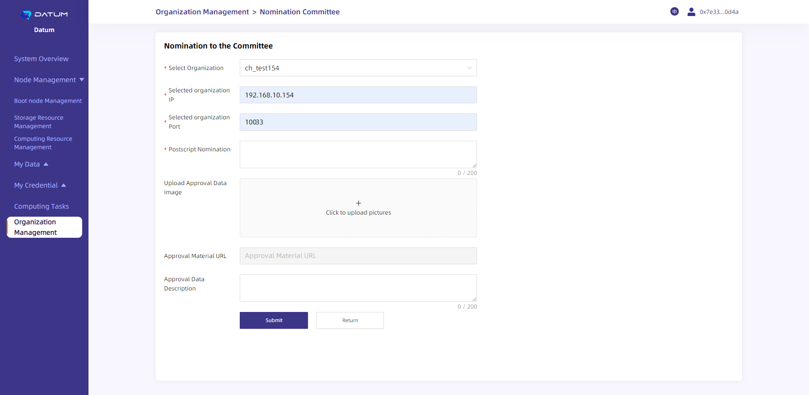

# [Datum-network Help Document (for Admins)](https://forum.latticex.foundation/t/topic/6334)

## **Overview**

Datum-network is a distributed privacy computing network based on the underlying capabilities of privacy AI.

Datum-network’s console provides an interface through which data providers and computing power providers can manage raw data and computing resources.

Users can deploy their Datum-network node locally to connect to the network. In addition, data providers can manage their data in a more reliable local environment, while computing power providers can share their computing power to improve the network’s computing performance and earn profits.

Here is how Datum-network nodes are deployed：https://github.com/datumtechs/datum-network-deploy/tree/ansible_v0.5.0

For users’ convenience, Datum-network offers five data sets that they can publish and use. Download link:
Finance: http://testdownload.datumtechs.com/datum/dataset/Finance.zip
Media Advertisement: http://testdownload.datumtechs.com/datum/dataset/MediaAdvertising.zip
Medical & Health: http://testdownload.datumtechs.com/datum/dataset/Medicalhealth.zip
Public Service: http://testdownload.datumtechs.com/datum/dataset/Publicservice.zip
Transportation: http://testdownload.datumtechs.com/datum/dataset/Transportation.zip

Users can claim test tokens via the following address: [PlatON](https://faucet.platon.network/faucet/)

## **Console Login**

After completing the node deployment, you will need to log in to Datum-platform to go through the connection settings.

You can directly log in to the console through MetaMask, without additional registration.

1. Open the deployed console address in Chrome, and then enter the console homepage; click on [Metamask], and select [Switch Network] in the pop-up window to switch the network to the PlatON DevNet (development network).

2. Once the network is switched to the PlatON DevNet, choose your account for the connection.

3. After the connection is confirmed, click on [Signature] and complete the authorization process to go to the console.

## **User Initialization**

**1. Apply for Identity**

Once a node is deployed, the first user who logs in to the console will be able to initialize the node, and the user will become the administrator.

(1) Create the organization identity (to be displayed on the network), set the avatar of the organization, and fill in the organization profile.

（2）初始化身份标识(DID)，身份标识(did)是去中心化的身份用户, 用于项目中的数据资产化,工作流运行,清算等多个环节. 而初始化身份标识需要内置管理员钱包支付一定的手续费, 请确保初始化身份标识前钱包有一定的余额。

(2) DID Initialization: Decentralized identity (DID) is required by multiple processes, covering data tokenization, workflow operation, liquidation, etc. To initialize the DID, you'll need to pay a fee through the built-in admin wallet. Please make sure that you have sufficient balance before initializing your DID.

（3）设置机构头像、填写机构描述。

(3) Set the organization icon and fill in the organization intro.

（4）Get registered to connect to the network, and then complete the initialization settings.

Upon successful initialization, the system will automatically generate a built-in wallet address, which will be used to pay service fees for the execution of computing tasks.

**2. User Center (available only to admins)**

Upon successful initialization, administrators can click on the upper right corner to log in to their accounts and view the relevant node information, including connection status and address information. Admins can also modify the management address and check the built-in wallet and its balance.

(1) Organization information.

(2) Connection status.

(3) Change admin, and check the built-in wallet.

## **Overview of the Console**

The console shows the system resources of the connected node, including CPU, memory, bandwidth, and fee consumption, as well as the tasks performed by the node, which covers the amount of data published and the overview of computing tasks.

## **Node Management (available only to admins)**

**1. Boot Node Management**

Datum-network’s new nodes need to connect to a boot node to be discovered by other participants in the network.

When you initialize and register a node, by default, the system will connect it to an initial seed node (the default boot node). You can always go to [Node Management] - [Boot node Management] to update, maintain, or replace the default boot node.

(1) Boot node management page

Click on [Node Management] - [Boot node Management] to enter the management page.

(2) Add or delete boot nodes

Click on [Add a new Boot node] and enter the ID to add a new bootnode.

You can [Delete] a bootnode if you would like to.

**2. Storage Resource Management**

If you want to be a data provider and publish metadata and creat credentials via local services, you will first have to add “Storage Resource” in the console as a path for managing raw data and publishing metadata.

Click on [Node Management] - [Storage Resource Management] to open the management page.

**3. Computing Resource Management**

If you want to be a computing power provider and offer Datum computing resources, you’ll need to configure “Computing Resource” via the console.

Click on [Node Management] - [Computing Resource Management] to open the resource management page.

The default status of computing resources is “Disable”, and you can enable, disable, or rename the resources by clicking on the buttons under the [Actions] column.

After the computing resources become enabled, the system will schedule your computing resources according to the privacy computing tasks initiated by participants in the network.

## **My Data**

Through “My Data”, you can manage the original data to be capitalized. For instance, you can add/extract metadata (data information that can be publicly displayed) and issue credentials.

**[Data Addition]**

(1) Click on [My Data] - [Data Addition] to go to the page for adding data and extracting metadata.

（2）Select the local data file to be used (only CSV files are supported at the moment), then click on [Upload]. The system will automatically read the “Field” and “Data Type” contained in the original data, collectively referred to as metadata. Users can modify the usage scenarios: private computing, non private computing (data can only be used in the selected algorithm (private computing/non private computing), and multiple choices are supported), as well as the metadata information read, and select "Visible to the public".

（3）After the basic information and field information are filled in and confirmed, you should then click on [Submit] at the bottom of the page to upload the metadata to the present node and enter the [Data Management] module.

**[Data Management]**

You can publish metadata and manage your data through [My Data] - [Data Management].

- Metadata added through [Data Addition] will appear as “Unpublished” by default. After clicking on [Publish Data], the metadata will be published on Datum-platform’s data market and become available to other participants. Meanwhile, its status will be changed to “Publish Data”.
- Click on [View] to view the metadata details.
- Click on [Download] to download the data uploaded to the present node to your device.
- Click on [SaveAsNewData] to add a new piece of data to the node based on the published metadata. You can change the display information of the metadata before publishing.
- Click on [Publish data credential] to issue Data Token based on your data.

**[Publish Data Credential]**

(1) Go to [My Data] - [Publish data credential] to set the token parameters, including type, basic information, and total circulation.

You can also click on “Publish data credential” in [Data Management] to go to the page

（2）Select the type of credential to be issued: “No Attribute Credentials” are ERC-20 assets, while “Attributed Credentials” are NFTs.

（3.1）**Mint No-Attribute Credentials**: After selecting the data for the issuance of your Data Token, go to the [No-attribute Credential] information setting page to set the name, symbol, total circulation, and description of the credential.

- “Name”: the name of the credential seen in Datum-platform’s data market.
- “Symbol”: the symbol of the credential on the DEX.
- “Circulation”: the total amount that can be purchased by other users. Each Credential represents the right to use the corresponding data once.

After the relevant information is entered, click on [Publish Credential], complete signification confirmation for the transaction via Metamask to mint the credential

（3.2）**Mint Attribute Credentials**: After selecting the data for the issuance of your Data Token, go to the [Attribute Credential] information setting page to set the name and symbol of the credential.

- “Name”: the name of the credential seen in Datum-platform’s data market.
- “Symbol”: the symbol of the credential on the trading market.

After the relevant information is entered, click on [Publish Credential], and complete signification confirmation for the transaction via Metamask to mint the credential.

## **My Credential**

**[No Attribute Credential]**

1. Click on [My Credential] - [No Attribute Credential] to view and manage the credentials you published.

   数据资产凭证铸造完成后，需要对其绑定数据，完成数据绑定后，可以对凭证合约进行定价以及修改对应的使用场景消耗量，该值每24h内只能修改一次。

   Once a credential is minted, you should bind it with data, after which you’ll be able to price the credential contract and adjust the consumption amount for the corresponding application scenario. The consumption amount can only be adjusted once every 24 hours.

   （1）Data binding

   

   （2）Adjust consumption amout

   

   （3）Set initial price

   After the credential is minted, you’ll need to set the first price and provide liquidity for the DEX to complete the initial issuance.

   Data Tokens will form trading pairs with LAT as the reference price.

   

   After setting the first price, click on [Launch to marketplace], offer access authorization via Metamask, complete signature confirmation, and then provide liquidity of the token for the DEX.

   

   

2. Priced credentials with liquidity added are available on the DEX https://test.dipoleswap.exchange/

​	(1) First, confirm the importation of the Token.

​	（2）You can check the added Token via the Swap page on the DEX and purchase the Token through Swap or adjust the Token’s liquidity.

**[Attribute Credential]**

​    1.Click on [My Credential] - [Attribute Credential] to view and manage the credentials you published.

​    数据资产凭证铸造完成后，需要对其绑定数据，完成数据绑定后，可以对凭证合约创建凭证。

Once a credential is minted, you should then bind it with data, after which you’ll be able to create credentials for the credential contract.

​    （1）Data binding

（2）Creat Credential

- “Name”: the name of the credential seen in Datum-platform’s data market.
- “Expire Date”: the validity period of the credential.
- "Usage Scenarios": the computation types that the credentials can support.

After setting the relevant information, click on [Creat Credential], complete signification confirmation for the transaction via Metamask to accomplish the credential.

 （3）Launch

Click [Launch] button in Attribute Credential page, and choose a NFT market to launch the NFT.

（4）Details

Click [Detail] button in Attribute Credential page to see the detailed information.

## **Computing Tasks (available only to admins)**

Through “Computing Tasks”, the admin can view the privacy computing tasks performed by the present node.

Admins can click on [Computing Tasks] to check the list of computing tasks and their status.

Admins may choose any computing task and click on [View Detail] to go to the Task Details page.

Admins may choose any computing task and click on [View Log] to go to the log page.

## Organization Management (available only to admins)

**【Members of the Management Committee】**

Members of the Management Committee may nominate new members, propose the removal of existing members, apply for certification review, and withdraw from the committee.

Click on [Organization Management] to manage your organization.

(1) Nominate new members 

Members of the committee can nominate new members. A nomination proposal would only be passed if enough members of the committee voted for it. To initiate a nomination proposal, you should click on [Nomination of Members] on the Organization Management page and enter the Nomination page.

Select the organization in the “Select Organization” dropdown list, which shows all organizations that are not members of the committee.

Enter the organization’s IP in “Selected Organization IP”.

Fill in the corresponding port in “Selected Organization Port”.

(2) Propose the removal of members

A member of the committee may propose the removal of other members (other than the original members and itself). A removal proposal would only be passed if enough members of the committee voted for it. To initiate a removal proposal, you should click on [Nominations kicked out of the Committee] on the Organization Management page and enter the corresponding page. 

(3) Withdraw from the committee

Members other than the original members may click on [Withdraw Committee] and [Confirm] to make a withdrawal proposal, which does not require voting. During the 12-hour cooling-off period, the proposal can be revoked; the proposal will become valid once the cooling-off period is finished.

(4) Committee Affairs: My To-Do List. In My To-Do List, you can vote on nomination proposals and removal proposals and review the certification applications initiated by organizations.

Certification applications to be processed:

Nomination proposals to be processed:

Proposal details:

(5) Committee Affairs: My Done List. In My Done List, you can view the nomination proposals, removal proposals, and certification reviews that you've processed.

Details of affairs done 

(6) Committee Affairs: My Proposal. The “My Proposal” list shows all the proposals you initiated; proposals within the cooling-off period can be revoked.

Proposal details (not covered within the cooling-off period)

[Regular Organization]

A regular organization can join the committee through nomination proposals or apply for certification and become a certified organization on the Organization Management page.

Click on [Organization Management] to manage your organization.

Apply for certification: Select a node to review your application, and fill in the required information. Once the selected node approves your application, your organization will become a certified organization.

