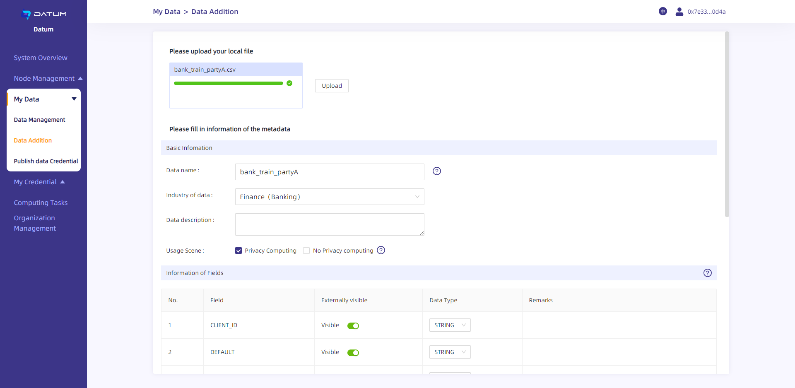

# **Datum-network Help Document (for Users)**

## Overview

Datum-network is a distributed privacy computing network based on the underlying capabilities of privacy AI.

Datum-network’s console provides an interface through which data providers and computing power providers can manage raw data and computing resources.

Users can deploy their Datum-network node locally to connect to the network. In addition, data providers can manage their data in a more reliable local environment, while computing power providers can share their computing power to improve the network’s computing performance and earn profits.

Users can also directly link to nodes already in the network to publish and manage data assets. Nodes with open connections are:

- OrgA：<http://8.219.63.100>
- OrgB：<http://8.219.62.193>
- OrgC：<http://8.219.4.134>

For users’ convenience, Datum-network offers five data sets that they can publish and use. Download link:

Finance: <https://testdownload.datumtechs.com/datum/dataset/Finance.zip>
Media Advertisement: <https://testdownload.datumtechs.com/datum/dataset/MediaAdvertising.zip>
Medical & Health: <https://testdownload.datumtechs.com/datum/dataset/Medicalhealth.zip>
Public Service: <https://testdownload.datumtechs.com/datum/dataset/Publicservice.zip>
Transportation: <https://testdownload.datumtechs.com/datum/dataset/Transportation.zip>

Users can claim test tokens via the following address: [PlatON](https://faucet.platon.network/faucet/)

## **Console Login**

You can directly log in to the console through MetaMask, without additional registration.

1.Select an open-connected node address in Chrome and enter the home page of the Datum-network console; click on [Metamask], and select [Switch Network] in the pop-up window to switch the network to the PlatON DevNet (development network).

2.Once the network is switched to the PlatON DevNet, choose your account for the connection.

3.After the connection is confirmed, click on [Signature] and complete the authorization process to go to the console.

## **Overview of the Console**

The console shows the system resources of the connected node, including CPU, memory, bandwidth, and fee consumption, as well as the tasks performed by the node, which covers the amount of data published and the overview of computing tasks.

## **My Data**

Through “My Data”, you can manage the original data to be capitalized. For instance, you can add/extract metadata (data information that can be publicly displayed) and issue credentials.

**[Data Addition]**

(1) Click on [My Data] - [Data Addition] to go to the page for adding data and extracting metadata.

(2) Select the local data file to be used (only CSV files are supported at the moment), then click on [Upload]. The system will automatically read the “Field” and “Data Type” contained in the original data, collectively referred to as metadata. Users can modify the usage scenarios: private computing, non private computing (data can only be used in the selected algorithm (private computing/non private computing), and multiple choices are supported), as well as the metadata information read, and select "Visible to the public".

(3) After the basic information filled in and confirmed the metadata, you should then click on [Submit] at the bottom of the page to upload the metadata to the present node and enter the [Data Management] module.

**[Data Management]**

You can publish metadata and manage your data through [My Data] - [Data Management].

- Metadata added through [Data Addition] will appear as “Unpublished” by default. After clicking on [Publish Data], the metadata will be published on Datum-platform’s data market and become available to other participants. Meanwhile, its status will be changed to “Publish Data”.
- Click on [View] to view the metadata details.
- Click on [Download] to download the data uploaded to the present node to your device.
- Click on [SaveAsNewData] to add a new piece of data to the node based on the published metadata. You can change the display information of the metadata before publishing.
- Click on [Publish data credential] to issue Data Token based on your data.

**[Publish Data Credential]**

(1) Go to [My Data] - [Publish data credential] to set the token parameters, including type, basic information, and total circulation.

You can also click on “Publish data credential” in [Data Management] to go to the page

(2) Select the type of credential to be issued: “No Attribute Credentials” are ERC-20 assets, while “Attributed Credentials” are NFTs.

（3.1） After selecting the data for the issuance of your Data Token, go to the information setting page to set the name, symbol, total circulation, and description of the credential.

- “Name”: the name of the credential seen in Datum-platform’s data market.
- “Symbol”: the symbol of the credential on the DEX.
- “Circulation”: the total amount that can be purchased by other users. Each Credential represents the right to use the corresponding data once.

After the relevant information is entered, click on [Publish Credential], complete signification confirmation for the transaction via Metamask to mint the credential.

（3.2）**Mint Attribute Credentials**: After selecting the data for the issuance of your Data Token, go to the [Attribute Credential] information setting page to set the name and symbol of the credential.

- “Name”: the name of the credential seen in Datum-platform’s data market.
- “Symbol”: the symbol of the credential on the trading market.

After the relevant information is entered, click on [Publish Credential], and complete signification confirmation for the transaction via Metamask to mint the credential.

## **My Credential**

**[No Attribute Credential]**

1. Click on [My Credential] - [No Attribute Credential] to view and manage the credentials you published.

   Once a credential is minted, you should then bind it with data, after which you’ll be able to price the credential contract and adjust the consumption amount for the corresponding application scenario. The consumption amount can only be adjusted once every 24 hours.

   （1）Data binding

   

   （2）Adjust consumption amount

   

   （3）Set initial price

   After the credential is minted, you’ll need to set the first price and provide liquidity for the DEX to complete the initial issuance.

   Data Tokens will form trading pairs with LAT as the reference price.

   

   After setting the first price, click on [Launch to marketplace], offer access authorization via Metamask, complete signature confirmation, and then provide liquidity of the token for the DEX.

   

   

2. Priced credentials with liquidity added are available on the DEX <https://test.dipoleswap.exchange/>

(1) First, confirm the importation of the Token.

​	(2) You can check the added Token via the Swap page on the DEX and purchase the Token through Swap or adjust the Token’s liquidity.

**[Attribute Credential]**

​    1.Click on [My Credential] - [Attribute Credential] to view and manage the credentials you published.

Once a credential is minted, you should then bind it with data, after which you’ll be able to create credentials for the credential contract.

​    （1）Data binding

（2）Creat Credential

- “Name”: the name of the credential seen in Datum-platform’s data market.
- “Expire Date”: the validity period of the credential.
- "Usage Scenarios": the computation types that the credentials can support.

After setting the relevant information, click on [Creat Credential], complete signification confirmation for the transaction via Metamask to accomplish the credential.

 （3）Launch

Click [Launch] button in Attribute Credential page, and choose a NFT market to launch the NFT.

（4）Details

Click [Detail] button in Attribute Credential page to see the detailed information.

