# [Datum-platform Help Document](https://forum.latticex.foundation/t/topic/6337)

## Overview

Datum-platform is a platform where users can purchase the right to use data assets, select Datum-network computation nodes, and initiate computing tasks according to their demands.

Trial address: [https://testmarkets.datumtechs.com](https://testmarkets.datumtechs.com/)

## Login Process

Users can directly log in to the platform through MetaMask, without additional registration.

1. Open the trial address in Chrome, click on [Metamask], and select [Switch Network] in the pop-up window to switch the network to the PlatON DevNet (development network).

2. Once the network is switched to the PlatON DevNet, choose an account for the connection.

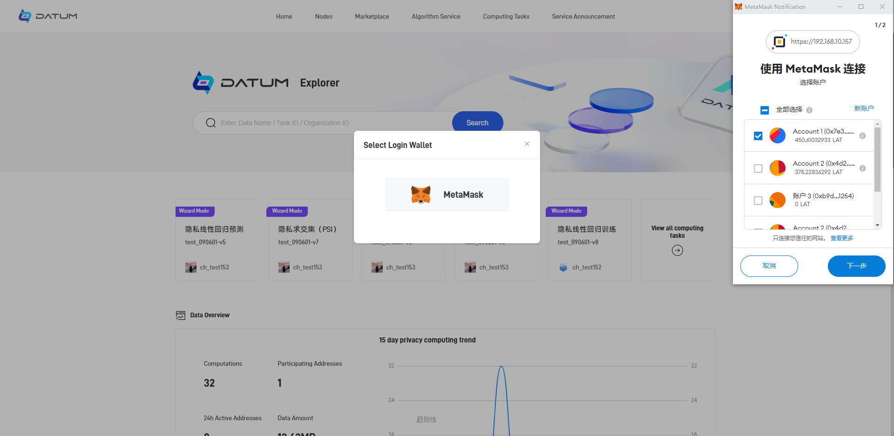

3. After the connection is confirmed, click on [Signature] and complete the authorization process to log in to the platform.

## Main Functions

1. Nodes

（1）“Nodes” shows the information about nodes in Datum-network that are available for privacy-preserving computation tasks.

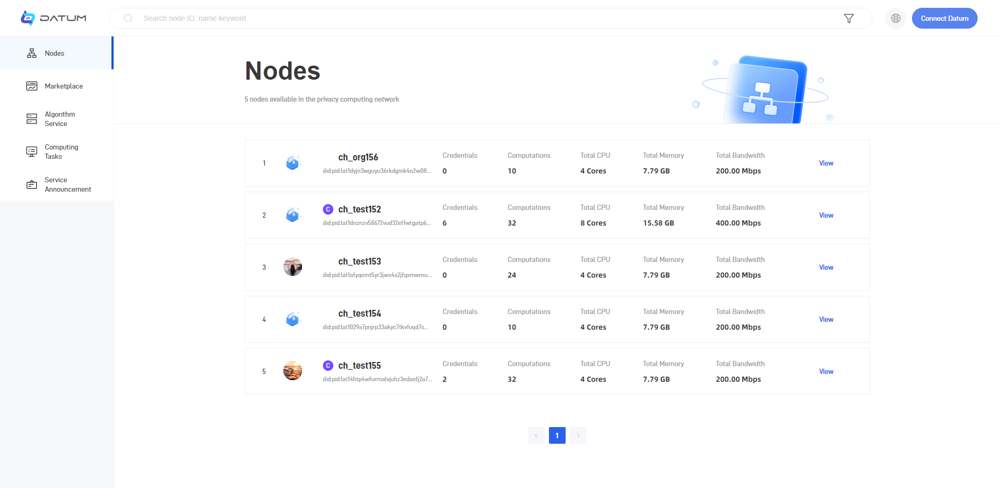

（2）Users can click on the details of any node to view the metadata published and the computing tasks executed.

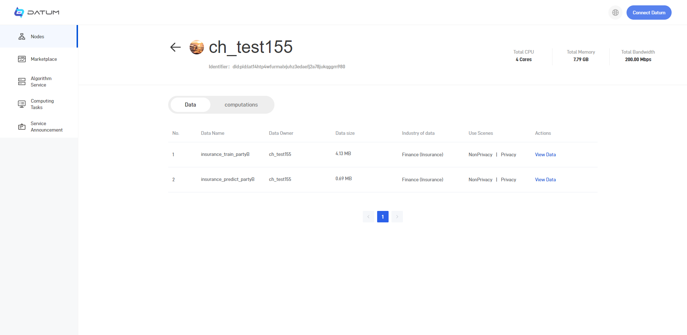

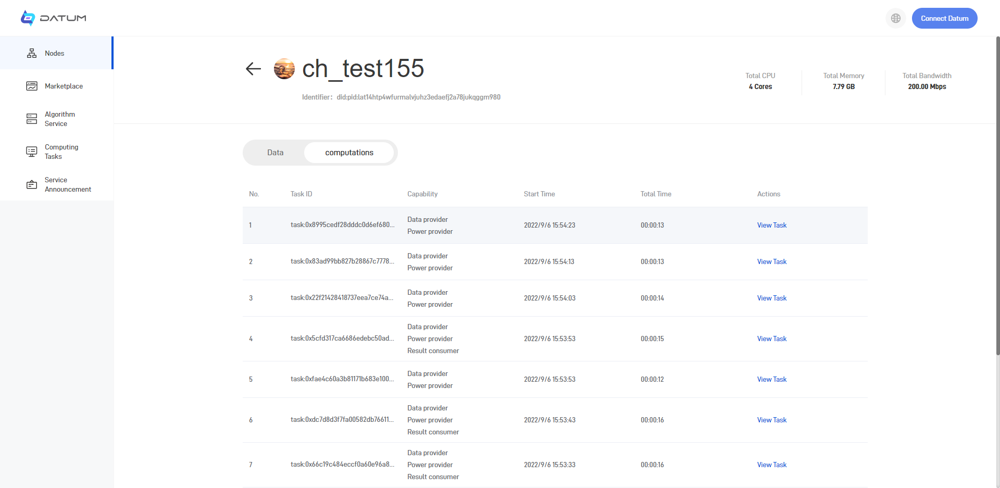

2. ####  Data Marketplace

   “Marketplace” shows all data credentials issued on the network and their prices. Users can click on [Purchase] to go to the DEX to complete the purchase of a data credential.

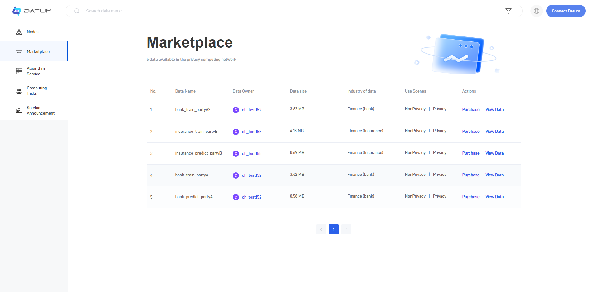

Credential list

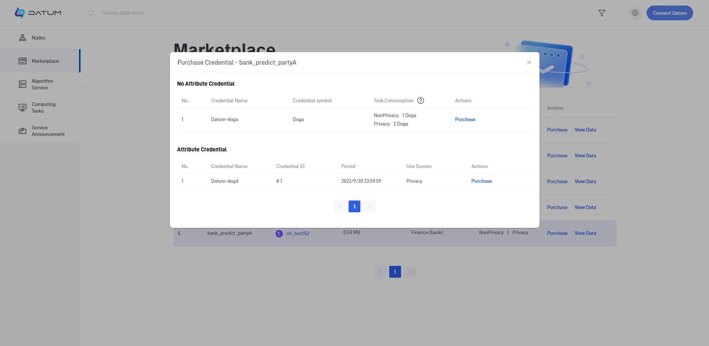

3. Computing Services

“Computing Services” is the portal for initiating computing tasks. It supports privacy computing tasks that involve multi-party data, as well as non-privacy AI computing tasks. Users can meet different computation requirements by selecting different algorithm templates.

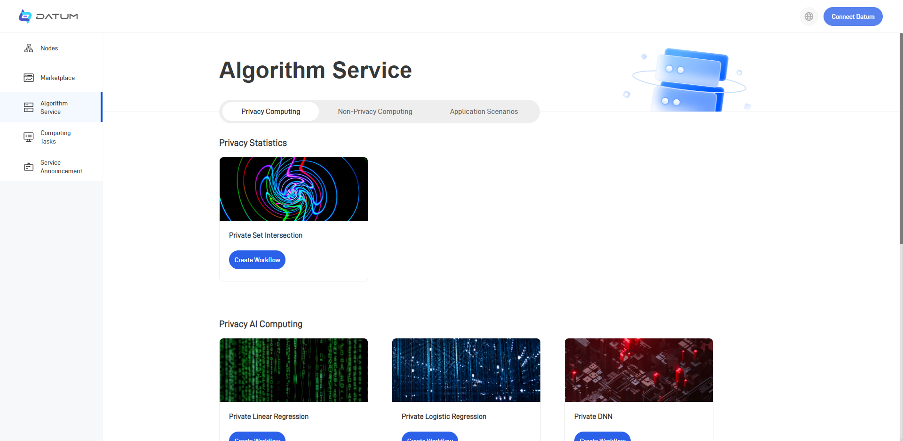

4. Computing Tasks

“Computing Tasks” allows users to check the current status of the computing task they initiated, covering basic information, participant information, and task events.

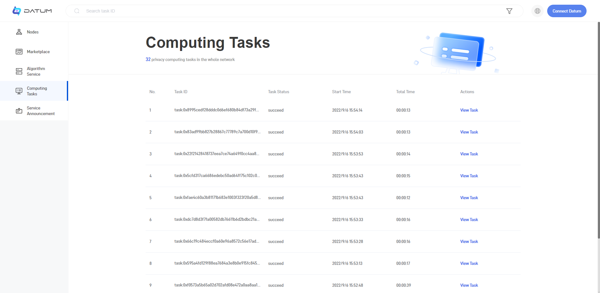

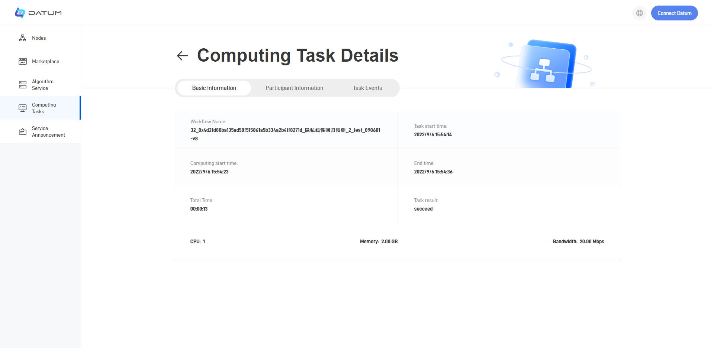

## Purchasing Data Credentials & Computing Process

1. Node Management

(1) Click [Account Information] - [Network Node Management] in the upper right corner to manage network nodes.

By default, the page shows the available nodes released by the Datum. Users may choose any node displayed on this page for the execution of privacy computing tasks.

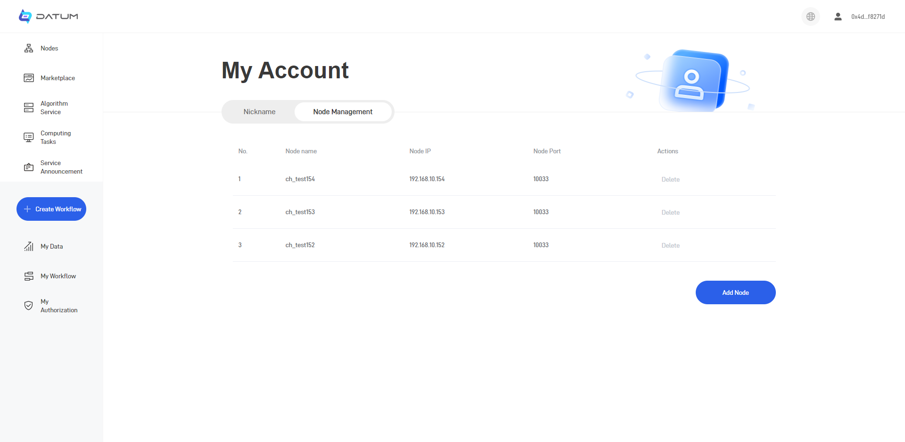

(2) Users can also manually add other known nodes for the execution of privacy computing tasks.

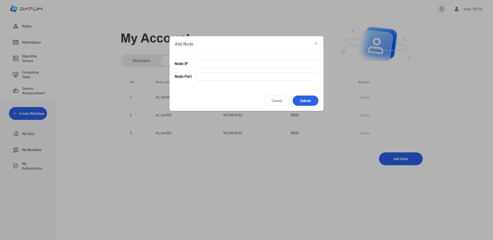

2. Purchase Data Credentials

(1) Click on [Marketplace] and select the target Data Credential.

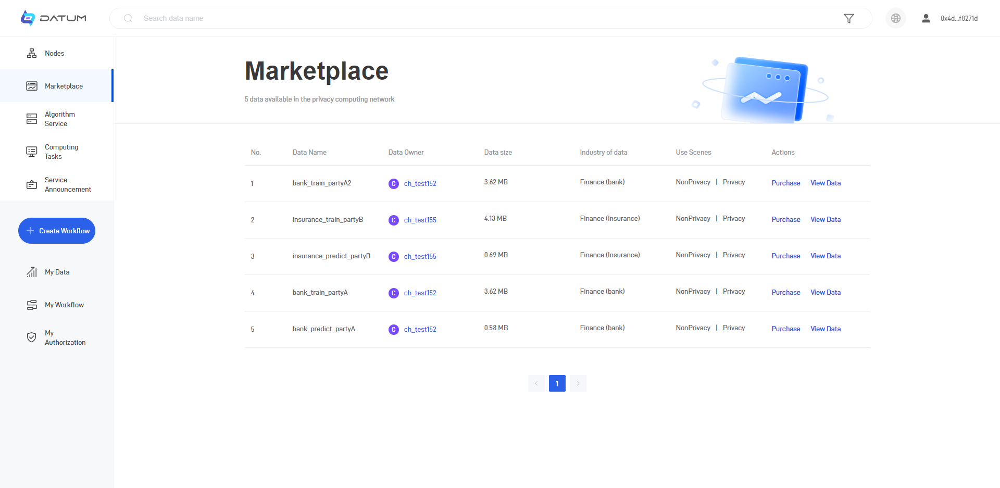

(2) Click on [View Data] to check the basic information, metadata, and tasks involved.

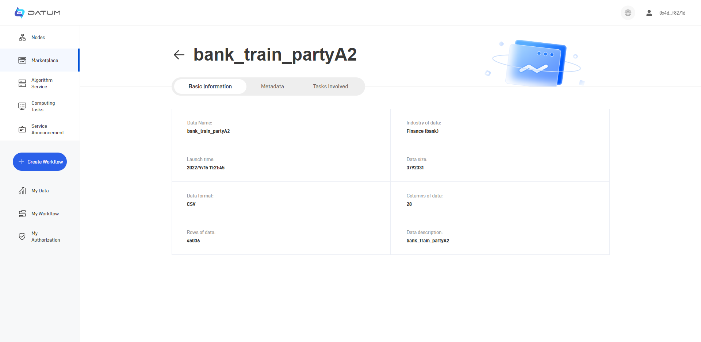

(3) Select [Purchase] to go to the DEX https://test.dipoleswap.exchange/ . Each computing task consumes one data credential, and users can purchase an amount of credentials that matches their demand.

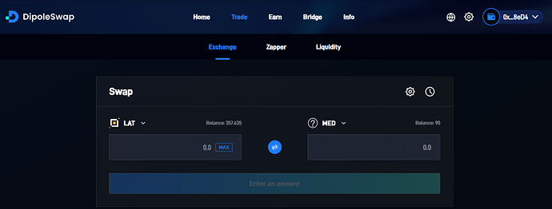

(4) Upon successful purchase, the purchased credentials will be shown in [My Data].

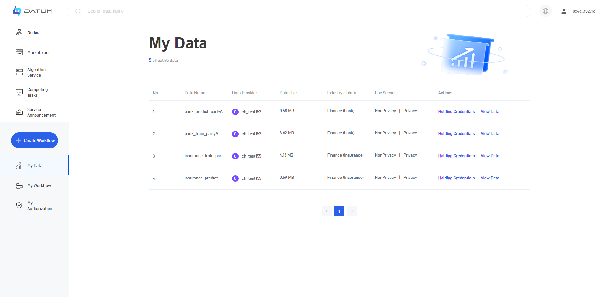

3. Authorization for Computation Node and Data Credential Usage

(1) Computation Node authorization

Authorize computation nodes can operate users’ authorized credentials when executing computing tasks.

Go to [My Authorization] - [Node authorization], select any node displayed on the page and add it to the whitelist. It should be noted that whitelist authorization requires signature confirmation via Metamask.

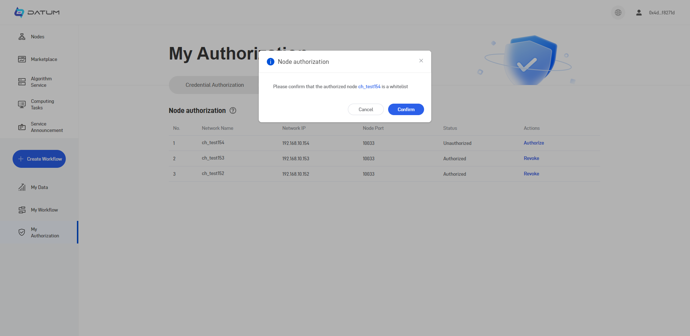

(2) Authorization for credentials

① WLAT authorization.

WLAT is a type of credential used to pay for executing fees Authorized WLAT refers to the preset max amount of WLAT that can be deducted by authorized nodes when executing computing tasks.

Go to [My Authorization] - [Credential authorization], enter the authorized WLAT amount. Users without any WLAT can click on the “Purchase” button to go to the DEX for purchase.

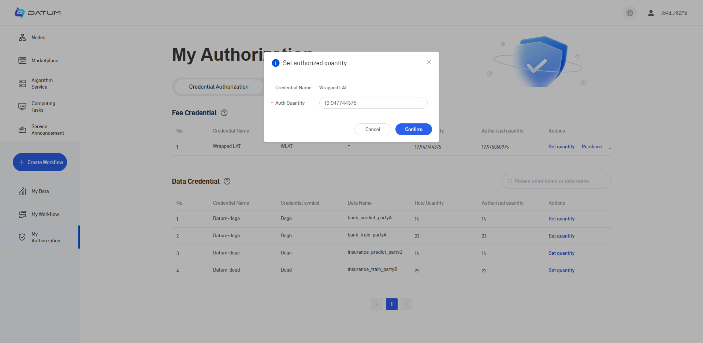

② Data Credential Authorization.

Authorized credential refers to the preset max amount of credentials that can be deducted by authorized nodes when executing computing tasks.

Go to [My Authorization] - [Credential Authorization], select the data credential need to be involved in the computing task, and set the authorized quantity (the max amount of credentials that can be deducted by authorized nodes when executing computing tasks).

4. Create a New Workflow

(1) Choose a privacy computing algorithm

Click on [Create Workflow] or [Computing Services] to select the privacy computing algorithm to be applied.

（2） Select the data to be used for computation

“Select task initiator” : the initiator must be an authorized node. It should be noted that if a PSI (Privacy Set Intersection) task is initiated, the initiator must be one of the data provider.

“Select data credential”: Here, data must be the credentials that users already purchased. Additionally, two data credentials in the same computing task cannot be published by the same node.

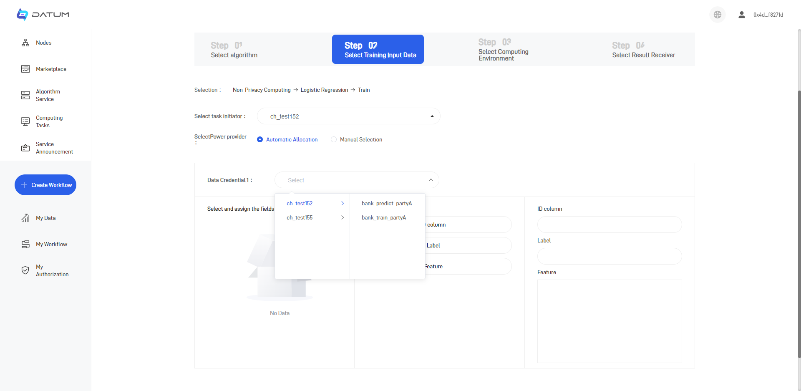

(3) Select the computing environment

When the Wizard Mode is selected, the computing task will require the minimum resource amount as determined by the default configuration. Users can revise the “Longest computing time” according to their needs.

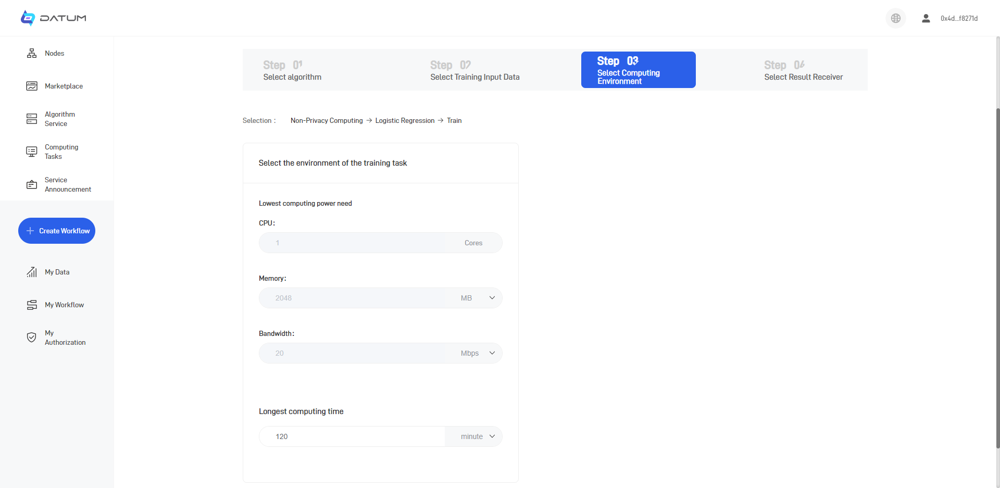

(4) Select the result receiver

Users need to select which node (one or two, as needed) will receive/save the computation result.

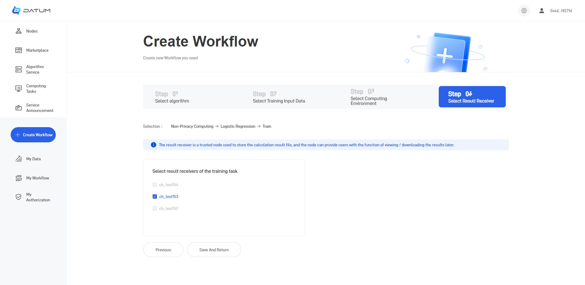

Finally, click on [Save and Return] to create this workflow.

5. Activate a Computing Task

(1) Click on [My Workflow] to go to the workflow management page.

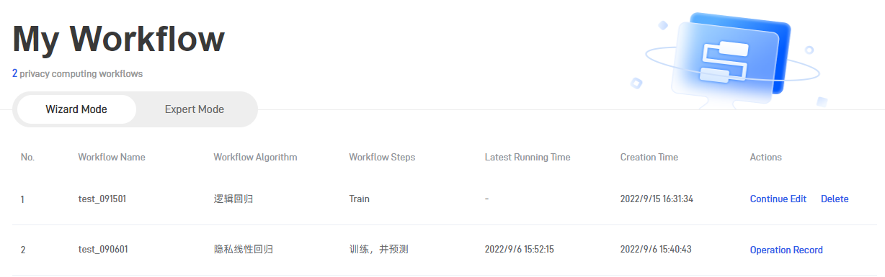

（2） Select any workflow and click on [Running Logs] to edit, activate, or suspend the relevant computing task.

After users click on [Activate], Datum will check whether the credentials involved in the computation has been fully authorized and whether the task initiator is an authorized node. If an abnormal authorization status is detected, an error will be reported, and the workflow will not be activated.

(3) After the workflow is activated, users can click on [View Details]/[View Results] to confirm the execution of the computing task.

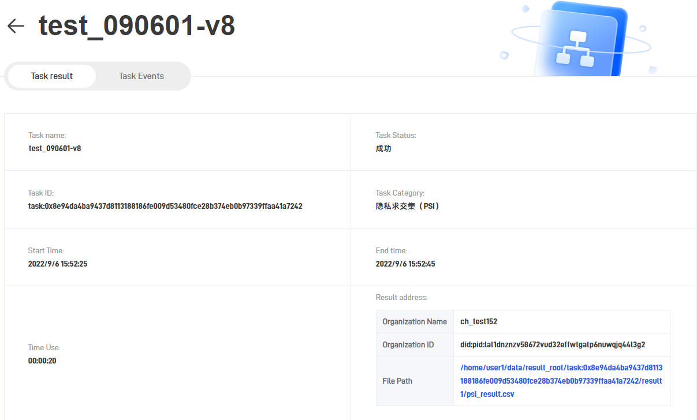

Upon completion of the privacy computing task, the result will be received by the selected node, and users may log in to the node to acquire the result file.

## Service Announcement 

Through Service Announcement, users can easily learn about the public information and proposals concerning all organizations on the network.

1. Trusted Organizations 

2. Committee Members

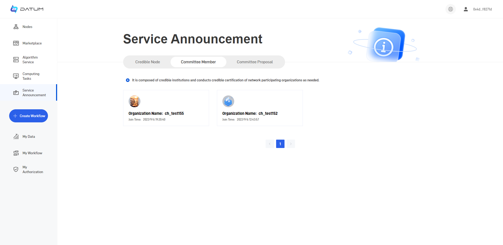

3. Committee Proposals

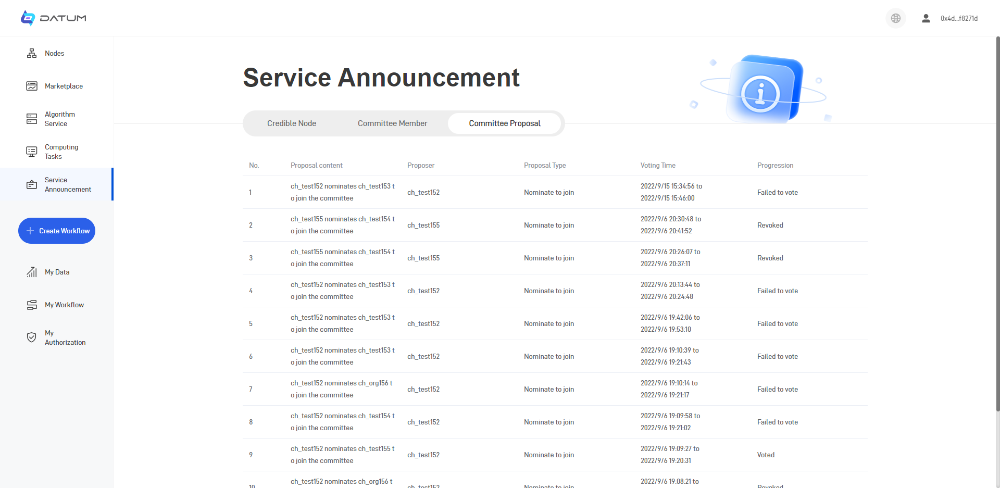

## Modes of Privacy Computing

1. Wizard Mode

The Wizard Mode provides standard algorithm templates according to different types of computing tasks. When users initiate a computing task in [Computing Services]/[Create Workflow], the Wizard Mode will be adopted by default.

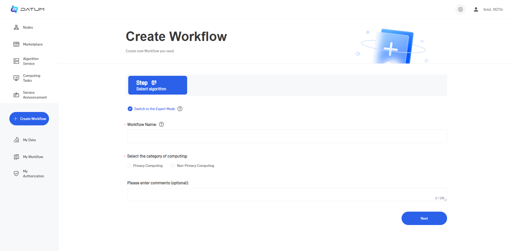

2. Expert Mode

The Expert Mode is designed for pro-level users. Under this mode, users can check the algorithm codes and adjust some of the algorithm variables manually.

Users can select the Expert Mode by clicking on [Switch to the Expert Mode] on the [Create Workflow] page.

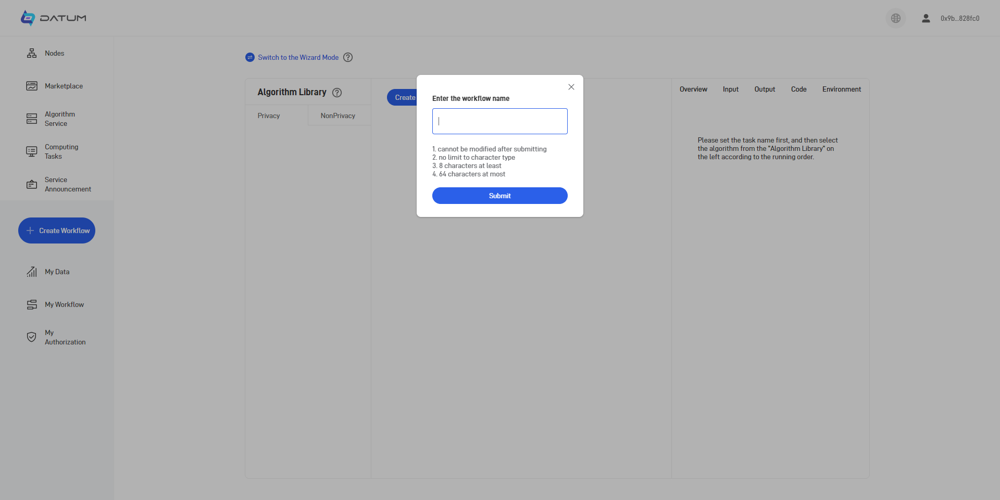