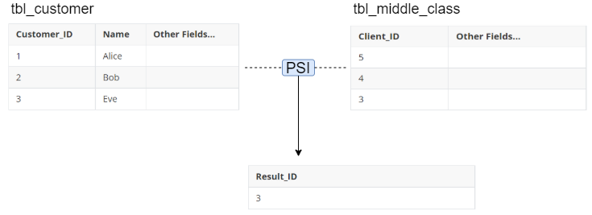
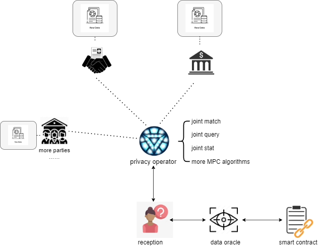

# 数据的联合查询

数字化为我们带来便利的同时，也把我们变成了别人的“矿”，很多垄断性的组织肆无忌惮的利用这种资源获取高额的回报。

同时存在另外一番光景：

随着生产经营活动的不断展开，不同组织都逐渐积累了大量的数据，形成了自己的“数据之湖”。

如何使这些“湖泊”流动起来成为“活水”同时接受监管给计算技术带来了课题与挑战。

近年来隐私计算技术迅速发展，成为满足这种需求的核心技术之一。

未来它将成为数字时代的基础设施，促进数据流通的同时守护数据隐私和安全。

我们考虑以下**案例**：

销售车辆的企业 A 有一个潜在的客户列表，他想回答这样一个问题：对于新上市的某车型号，*哪些人有能力买？*

一个简单的想法是：用户存的*钱是否够？*

但是显然银行不会把客户的存款数告诉你，但是也许可以提供一种合作的服务：某类人(如中产阶级)的列表。

这样就可以通过计算自己有哪些客户同时也在银行的那个列表中而得到有购买力的用户。

在这个过程中，参与方都没有透露比不必要的信息。

这就是隐私计算中的PSI ([Private set intersection](https://en.wikipedia.org/wiki/Private_set_intersection#:~:text=Private%20set%20intersection%20is%20a,the%20elements%20in%20the%20intersection.))。

类似的，现实中很多涉及到隐私的问题可以表示成如下**范式**：

**注意：**通过隐私算子保证各个参与方都拿不到其它方的隐私数据！

根据参与方的数量，模型或算子的类型可以衍生成一系列的隐私计算**算子**：

* 两方数据合作

  + 隐私匹配
  + 隐私标签查询
  + 隐私SQL查询
* 多方数据协作

  + 联合统计分析
  + 联合模型训练
  + 联合模型预测

为实现上述**面向应用的**、开箱即用的隐私计算功能，我们基于PSI、MPC、HE等不同**隐私增强技术**开发了Datum® 。

用户可以通过清晰简洁的API调用完成相应计算，无需过多了解不同的密码算法实现细节，降低了使用门槛，解决了传统数据共享的风险和担忧，使数据协作和流动更加顺畅。

详细的API使用说明，请参考[数据的联合查询API](./数据的联合查询API.md)。

**术语**：

+ 隐私集合求交（[Private Set Intersection](https://en.wikipedia.org/wiki/Private_set_intersection), PSI），是指持有原始数据的两方能够计算得到双方数据的交集，但互相不暴露交集以外的原始数据集中任何信息。它支持DH（Diffie-Hellman）和HE（同态加密）两种算法实现。
+ 隐私标签查询，它使用基于标签的隐私求交集技术（Labeled Private Set Intersection），在查询方不泄露查询的内容，且被查询方不泄露交集以外的数据的前提下，查询方能获取双方数据的交集及交集对应的标签数据。它支持DH（Diffie-Hellman）和HE（同态加密）两种算法实现。
+ 安全多方计算（[Secure Multi-Party Computation](https://en.wikipedia.org/wiki/Secure_multi-party_computation),  MPC），一组互不信任的参与方在保护各自数据隐私的前提下，共同完成对某约定函数的计算，并得到正确的计算结果。它要求每个参与方除自身数据（和计算结果）外，不能得到其他参与方的预期泄露之外的私有信息。
+ 同态加密（[Homomorphic Encryption](https://en.wikipedia.org/wiki/Homomorphic_encryption),  HE），是一种特殊的加密方法，它允许用户在加密之后的密文上直接进行特定形式的代数运算，其计算结果解密后正好与明文的计算结果是一致的。
+ [隐私AI框架Rosetta](../参考/隐私AI框架Rosetta.md)，是基于Tensorflow的隐私AI框架，承载和结合AI、隐私AI和区块链三种典型的技术，大大降低了AI开发者的门槛，让AI开发者在对隐私AI技术没有深入了解的情况下，只需要改动两三行代码即可实现将现有AI代码转换为具备数据隐私保护功能的程序。

