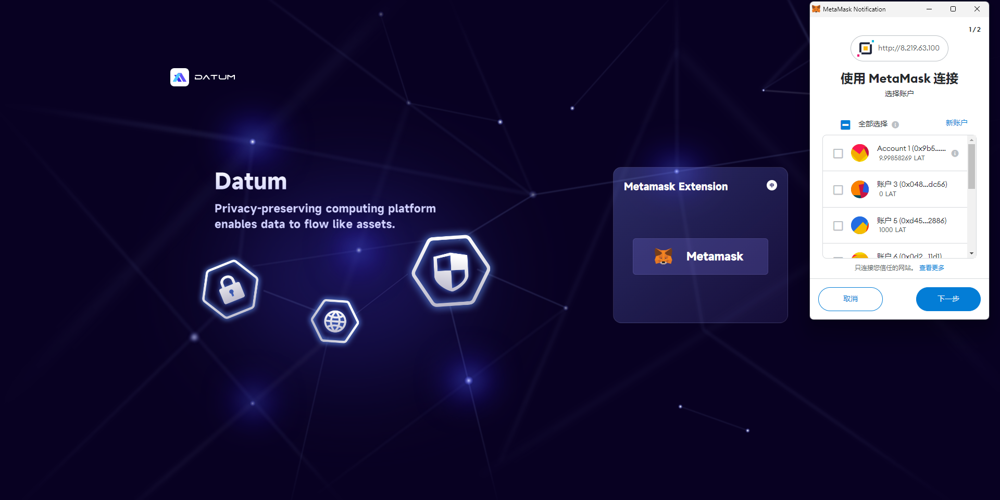

# Datum-network操作帮助文档（用户版）

## 概述

Datum-network是基于隐私AI底层能力构建的分布式隐私计算网络。

Datum-network管理台面向数据提供方、算力提供方提供了一个可对原始数据、算力资源进行统一管理的门户界面。

用户可以选择在本地部署Datum-network节点并接入网络，对于数据提供方可以使自身数据能够在更加可靠的本地环境中进行管理，对于算力提供方可以提供算力分享帮助网络提高计算性能并获得收益。

节点部署方式参见：https://github.com/datumtechs/datum-network-deploy/tree/ansible_v0.5.0

为方便体验，提供5套数据集可供发布使用，下载路径为：

- 金融：<https://testdownload.datumtechs.com/datum/dataset/Finance.zip>
- 媒体广告：<https://testdownload.datumtechs.com/datum/dataset/MediaAdvertising.zip>
- 医疗保健：<https://testdownload.datumtechs.com/datum/dataset/Medicalhealth.zip>
- 公共服务：<https://testdownload.datumtechs.com/datum/dataset/Publicservice.zip>
- 运输：<https://testdownload.datumtechs.com/datum/dataset/Transportation.zip>

- 测试Token领取地址：[https://faucet.platon.network/faucet/](https://faucet.platon.network/faucet/)

## 管理台登录

用户完成节点部署后，需要登录Datum-platform完成入网设置。

管理台通过MetaMask区块链钱包可直接登录，无需额外注册。

1. 在Chrome中打开部署的管理台地址，进入datum-network管理台首页；点击【Metamask】按钮，在跳出的弹窗中，点击【切换网络】按钮，将网络切换至PlatON开发网络。

   

2. 切换至PlatON开发网络后，选择一个连接账号。

   

3. 确认连接后，点击【签名】按钮，完成签名后既能进入管理台页面。

   

## 管理台概况

展示连接节点的系统资源情况，包括CPU、内存、带宽及消耗情况；以及该节点执行的任务情况，包括数据发布量、计算任务概况。

## 我的数据

对用户需要资产化的原始数据进行管理，包括添加提取元数据（可对外发布展示的数据信息）、发布数据资产凭证。

**【数据添加】**

（1）点击【我的数据】-【数据添加】进入添加数据、提取元数据页面。

（2）从本地选择需要使用的数据文件，系统暂时只支持CSV格式。选择文件后点击【导入文件】按钮，系统将自动读取原始数据中包含的“字段信息”和“格式类型”，统称为元数据。用户可以修改使用场景：隐私计算、非隐私计算(数据仅可在所选的算法(隐私计算/非隐私计算)中使用, 支持多选),以及读取的元数据信息，并选择“是否对外可见”。

（3）用户完成基本信息填写、确定字段信息后，点击页面下方的【提交】按钮，即可将该元数据上传至此网络节点，并进入【数据管理】模块。

**【数据管理】**

用户可以通过【我的数据】-【数据管理】进入元数据发布、发布数据管理页面。

通过【数据添加】新增的元数据状态默认为“未发布”，点击【发布数据】后该元数据会发布至Datum-network配置的数据服务节点，同时状态变更为“已发布”。

点击【查看】可查看元数据详情。

点击【下载】可将上传至该节点的数据下载至本地。

点击【复制】以发布的元数据为基础，向数据节点添加一份新数据，可以修改元数据展示信息后再发布。

点击【发布凭证】可以该数据为基础，发行数据资产（Data Token）。

**【发布数据凭证】**

（1）点击【我的数据】-【发布数据凭证】进入发布数据凭证页面，可选择需要发布的数据凭证类型：无属性数据凭证、有属性数据凭证。

​		也可在【数据管理】页面中点击“发布凭证”按钮进入该页面。

（2）选择发布凭证种类，“无属性数据凭证”为ERC-20资产，“有属性数据凭证”为NFT资产。

（3.1）无属性数据凭证发布：选择需要发行数据资产的数据后，选择无属性数据凭证，进入信息设置页面，需要设置凭证名称与符号、总发行量、隐私计算消耗量、非隐私计算消耗量信息。

​		“凭证名称”，在Datum-platform数据市场展示中显示。

​		“符号”，在Dex上作为该资产的代号。

​		“总发布量”，可被其他用户购买的总量，每个凭证代表了该数据的一次使用权。

​        “隐私计算消耗量”，数据凭证在隐私计算场景下的单次消耗量。

​        “非隐私计算消耗量”，数据凭证在非隐私计算场景下的单次消耗量。

​		信息录入后点击【发布凭证】按钮，需要Metamask钱包对该交易签名确认，完成资产凭证的铸造。

（3.2）有属性数据凭证发布:选择需要发行数据资产的数据后，选择有属性数据凭证，进入信息设置页面，需要设置凭证名称与符号信息。

​		“凭证名称”，在Datum-platform数据市场展示中显示。

​		“符号”，在交易市场上作为该资产的代号。

​		信息录入后点击【发布凭证】按钮，需要Metamask钱包对该交易签名确认，完成资产凭证的铸造。

## 我的凭证

**【无属性数据凭证】**

1. 点击【我的凭证】-【无属性数据凭证】查看、管理已发布的数据资产凭证。

    数据资产凭证铸造完成后，需要对其绑定数据，完成数据绑定后，可以对凭证合约进行定价以及修改对应的使用场景消耗量，该值每24h内只能修改一次。

   绑定数据：

   

   修改消耗量：

   

   凭证定价：

   设置初始发行价，并以向Dex添加流动性的方式完成初始发行。

   数据资产价格以LAT作为参照交易对。

   

   设置完数据资产凭证初始价格后，点击【上架数据市场】按钮，需要Metamask钱包先授权访问该资产，再对该交易签名确认，完成向Dex添加该资产的流动性。

   

   

2. 已定价并添加流动性的资产凭证，可在Dex（<https://test.dipoleswap.exchange/>）中查看。

​	（1）先确认导入该资产。

​	（2）在Dex中的Swap页面即可查看到添加的资产情况，也可以通过Swap进行该资产凭证的购买。

**【有属性数据凭证】**

​    1.点击【我的凭证】-【有属性数据凭证】查看、管理已发布的数据资产凭证。

​    数据资产凭证铸造完成后，需要对其绑定数据，完成数据绑定后，可以对凭证合约创建凭证。

​    绑定数据：

创建凭证：

“凭证名称”，在Datum-platform数据市场展示中显示。

“有效截止日期”，凭证的有效使用期限。

 “使用场景”，凭证可以支持的计算类型。

设置完上述信息后，点击【创建凭证】按钮，需要Metamask钱包对该交易签名确认，完成凭证创建。

 上架：

 点击【凭证库存】页面操作栏中的【上架】按钮，可以选择需要上架NFT的交易所。

 查看详情：

点击【凭证库存】页面操作栏中的【查看详情】按钮，可以查看凭证详细信息。

