# Datum-platform操作帮助文档

## 概述

Datum-platform是用户可以按需购买数据资产使用权、选择Datum-network计算节点、发起计算任务的平台。

平台体验地址：https://testmarkets.datumtechs.com

## 平台登录

用户通过MetaMask区块链钱包可直接登录，无需额外注册。

1. 在Chrome中打开平台体验地址，点击【Metamask】按钮，在跳出的弹窗中，点击【切换网络】按钮，将网络切换至PlatON开发网络。

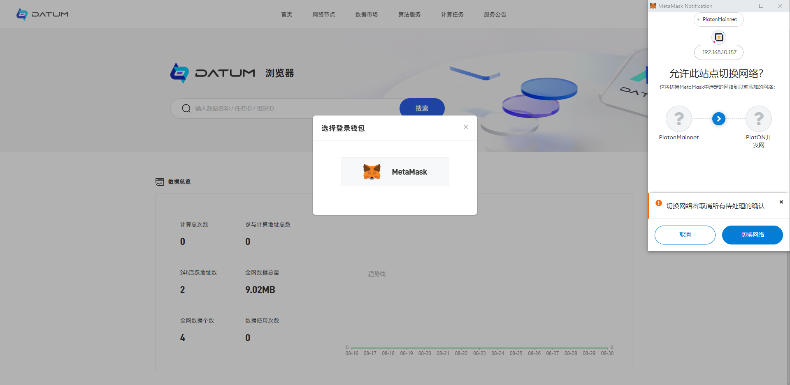

2. 切换至PlatON开发网络后，选择一个连接账号。

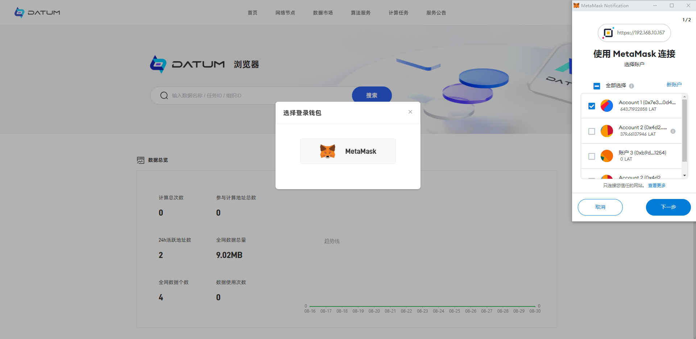

3. 确认连接后，点击【签名】按钮，完成签名后就可登录平台。

## 主要功能

1. #### **网络节点**

（1）展示Datum-network中可参与隐私计算任务的节点信息。

（2）点击任意一个节点详情，可查看通过该节点发布的元数据，和执行的计算任务信息。

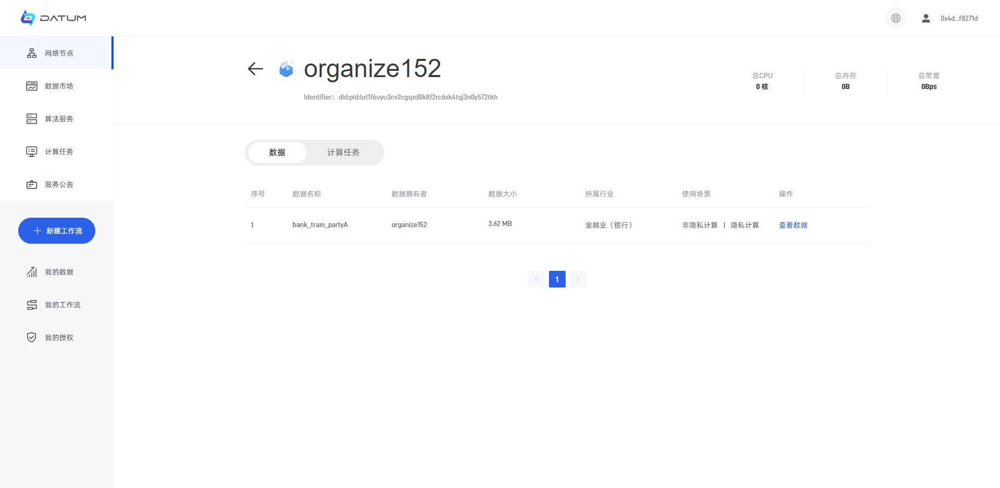

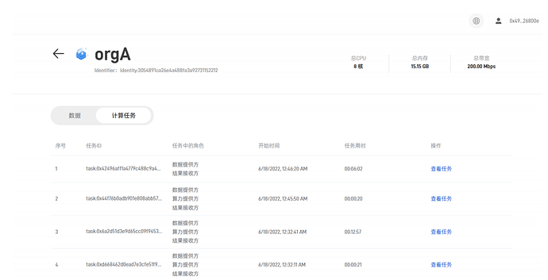

2. #### **数据市场**

展示全网发布的数据资产凭证信息，及其价格，点击【购买】按钮，打开数据对应的凭证列表页面，选择需要的凭证类型进行购买。

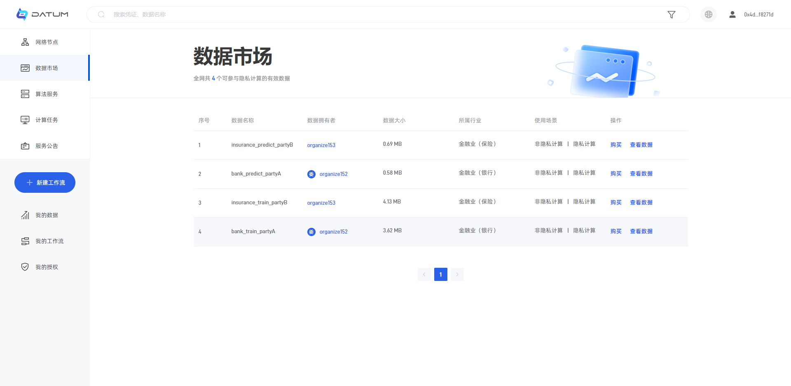

凭证列表：

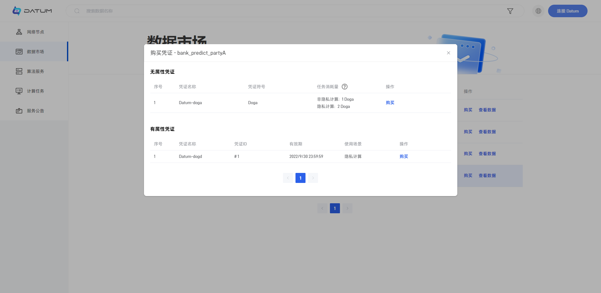

3. #### **计算服务**

发起各类计算任务的入口，支持多方数据的隐私计算，与非隐私的AI计算。用户可以通过选择不同的算法模板实现计算需求。

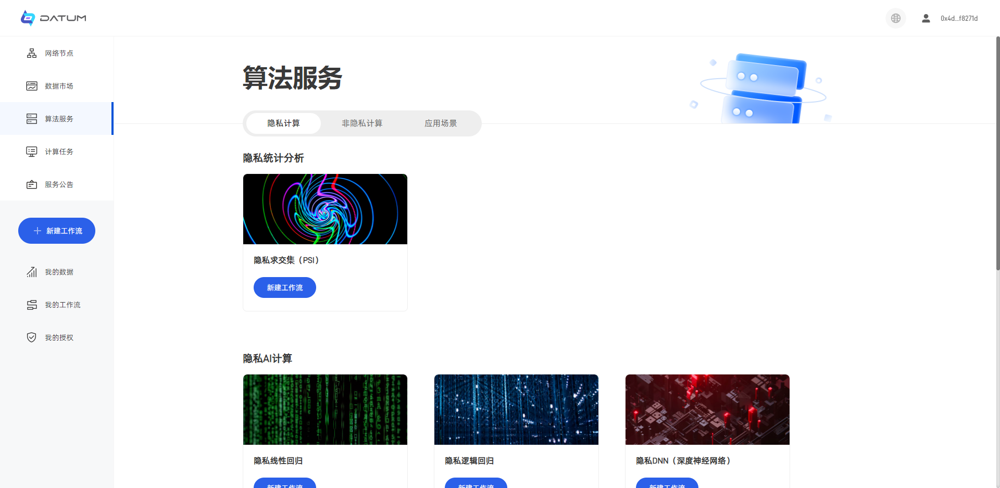

4. #### **计算任务**

查看已发起的计算任务情况，包括基本信息、计算参与方、任务事件详情。

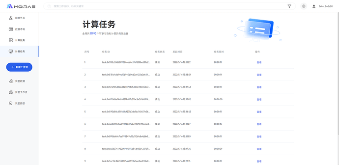

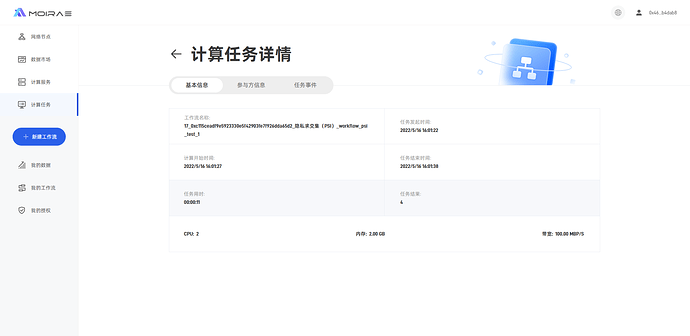

## 数据资产凭证购买与计算流程

1. #### **网络节点管理**

（1）点击右上角【账户信息】-【网络节点管理】进入网络节点管理页面。

网络节点管理默认展示官方发布的Datum-network可开放连接的节点，用户可以任意选择此页面展示的节点执行隐私计任务。

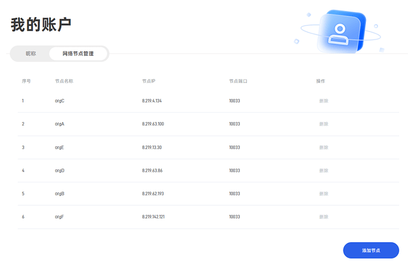

（2）用户也可手动添加其它已知的节点做为隐私计算任务执行方。

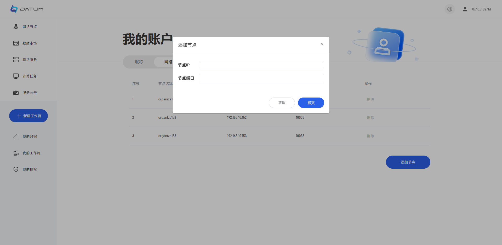

2. #### **数据资产凭证购买**

（1）点击【数据市场】，选择需要使用的数据资产。

（2）点击【查看数据】，可以查看该数据的基本信息、元数据，及参与的计算任务。

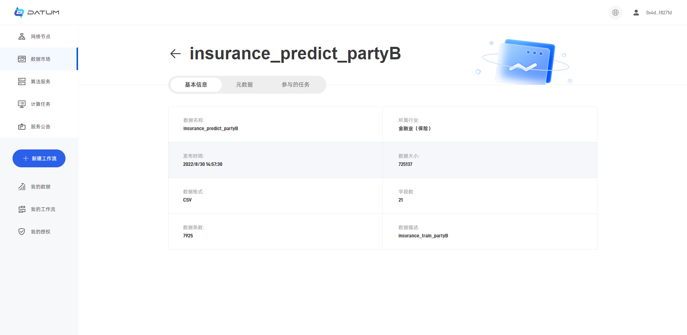

（3）点击【购买】，弹出购买凭证弹窗，点击无属性凭证列表中的【购买】按钮，跳转至Dex（https://test.dipoleswap.exchange/）页面，可按照计算需求购买对应数量的凭证。

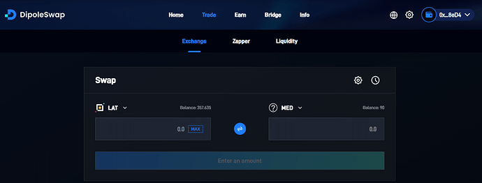

（4）购买成功后，已购买的数据资产凭证会在【我的数据】页面展示。

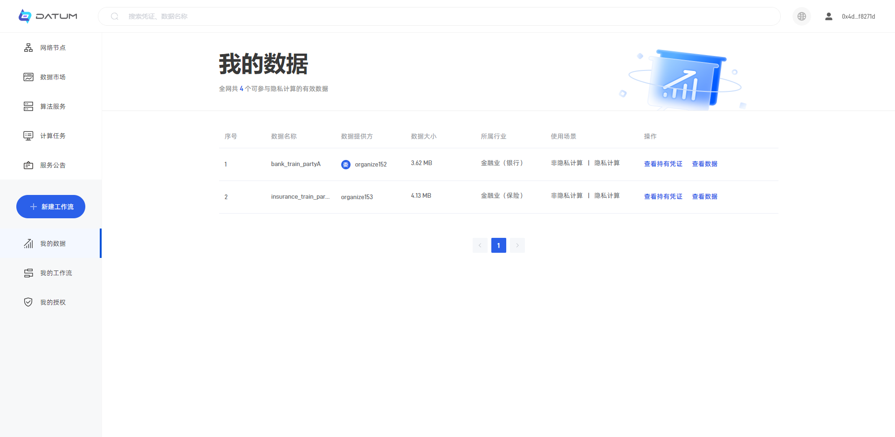

3. #### **计算节点与使用凭证授权**

（1）计算节点授权

授权节点有权在计算任务执行中操作用户已授权的数据资产凭证。

点击【我的授权】-【节点授权】，可以选择此页面展示的任意节点添加至白名单，授权需要调用Metamask钱包对该交易签名确认。

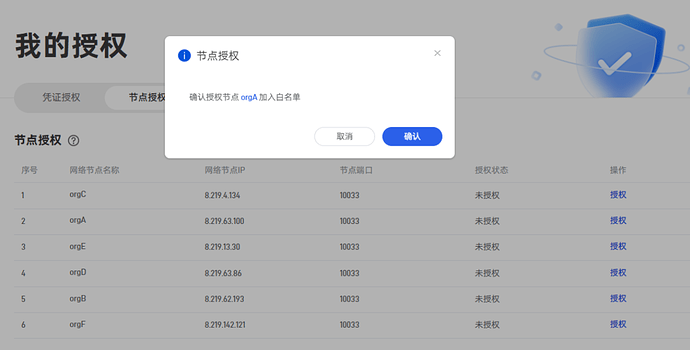

（2）使用凭证授权

① 手续费凭证授权，授权节点可在计算任务执行中扣除的手续费总额度。

点击【我的授权】-【凭证授权】，输入手续费凭证授权数量，该凭证以WLAT计量。如没有WLAT，可点击“购买”按钮跳转至Dex进行购买。

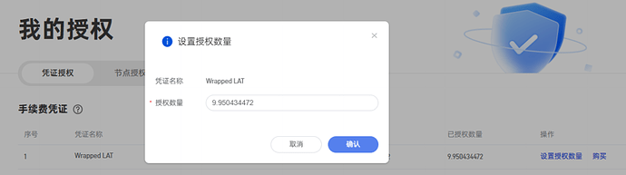

② 数据凭证授权，授权节点可在计算任务执行中扣除的数据资产凭证总额度。

点击【我的授权】-【凭证授权】，选择需要参与计算的数据资产凭证，并设置授权数量。该数量可控制节点在执行中最大扣除的数额。

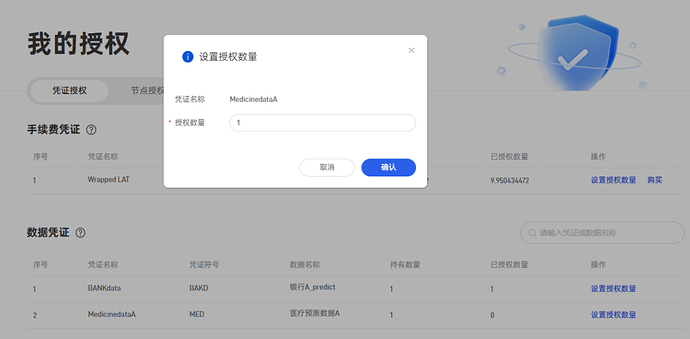

4. #### 新建计算工作流

（1）选择隐私计算算法

点击【新建工作流】，或者点击【计算服务】选择需要应用的隐私计算算法。

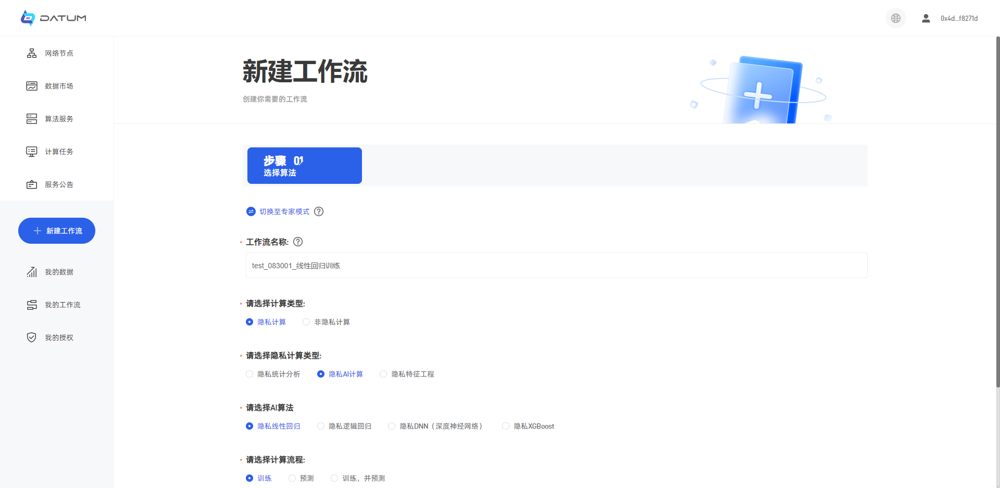

（2）选择参与计算的数据

“选择任务发起方”，需为已授权的网络节点。需要注意的是，如果发起一个PSI（隐私集合求交）任务，任务发起方必须为拥有数据的一方。

“选择数据”，需为已购买的数据资产凭证，且参与计算的2个数据不能由同一节点发布。

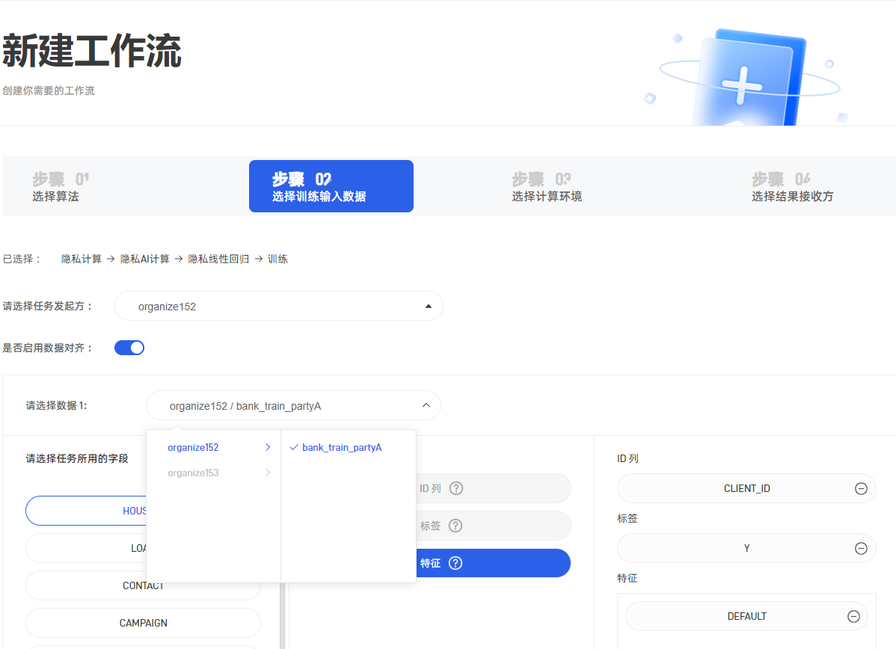

（3）选择计算环境

在引导模式下平台默认配置计算所需的最低资源要求，“最长运行时长”可按需填写。

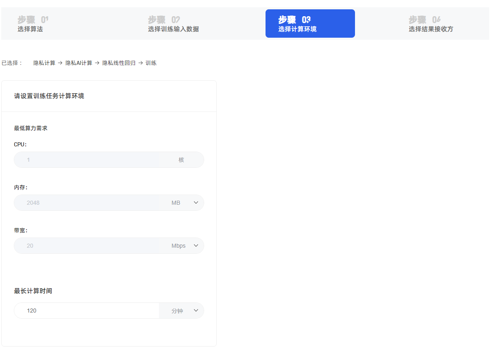

（4）选择计算结果接收方

选择计算完成后结果保存在哪个网络节点，可按需选择一方或保存至两方。

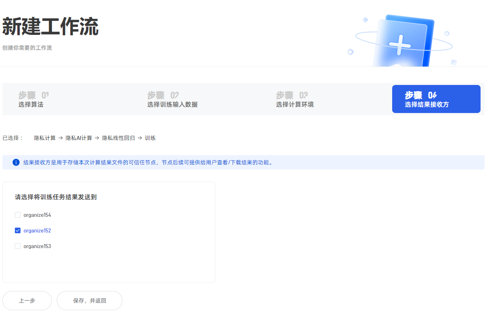

点击【保存，并返回】后，计算任务工作流创建完成。

5. #### 启动计算任务

（1）点击【我的工作流】进入工作流管理页面。

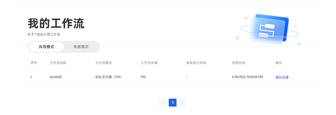

（2）选择任意一个工作流，点击【运行记录】按钮，可对该工作流内容进行编辑、启动或暂停计算任务。

点击【启动】按钮后，平台将校验参与计算的数据资产凭证是否已足额授权、任务发起方是否为已授权节点，如果存在授权异常将会报错提示，工作流无法启动执行。

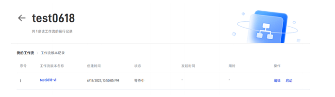

（3）工作流启动后，可点击【查看详情】/【查看任务结果】按钮确认计算任务执行情况。

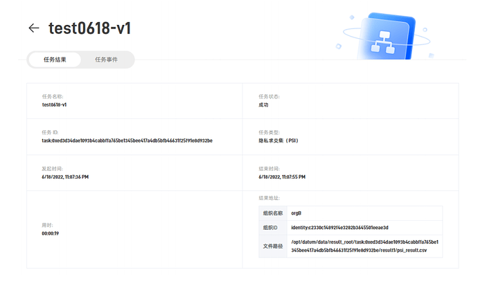

隐私计算任务执行完成后，计算结果将会输出在选定的节点路径下，可通过登录该路径获取结果文件。

## 服务公告

用户通过服务公告可以直观的了解到全网组织的公示信息以及提案信息。

1.可信组织

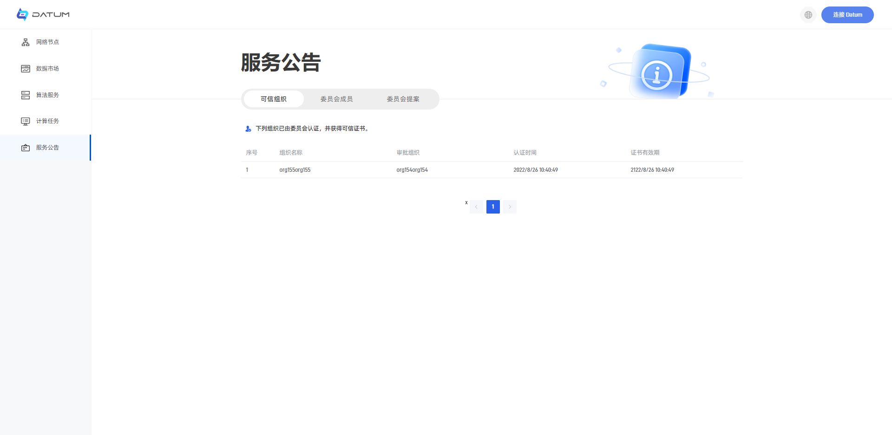

2.委员会成员

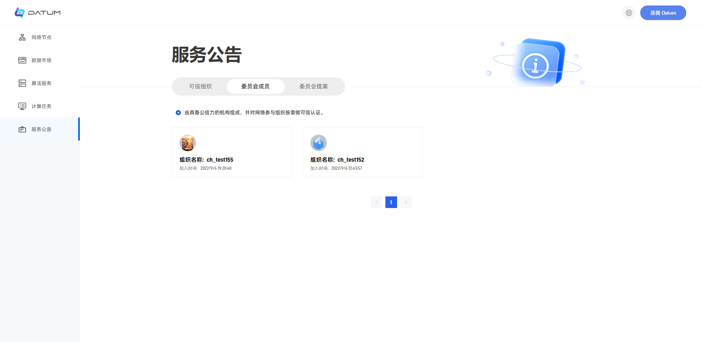

3.委员会提案

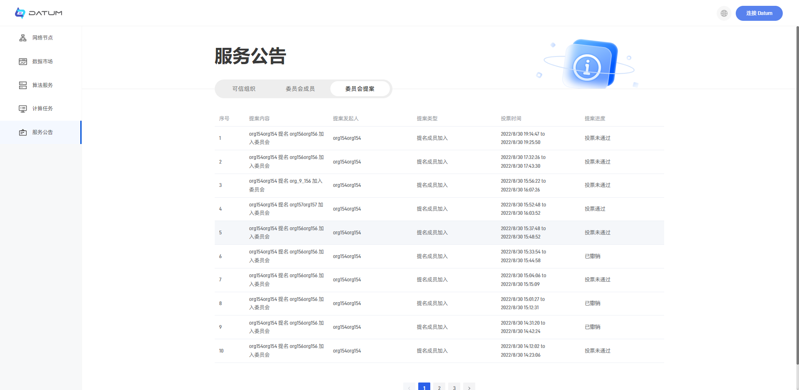

## 隐私计算模式介绍

1. #### 引导模式

按照不同计算类型，提供标准的算法设置模板，用户在【计算服务】/【新建工作流】中发起计算任务时，默认为引导模式。

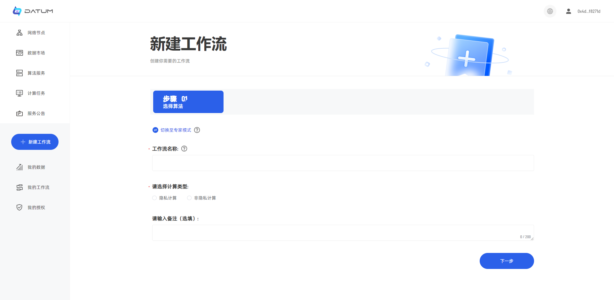

2. #### 专家模式

对专业用户，提供查看算法代码、支持对部分算法变量值进行修改的计算模式。

在【新建工作流页面】页面，点击【切换专家模式】即可实现。

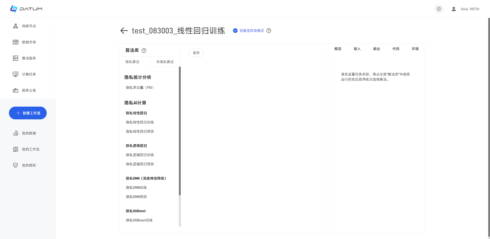